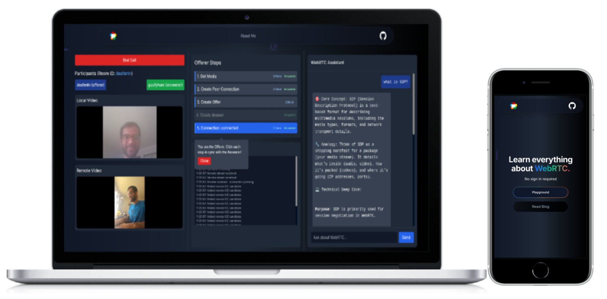

# Learn WebRTC

**Learn WebRTC** is an interactive project designed to help developers understand and implement WebRTC (Web Real-Time Communication) technology. This project provides hands-on examples and tutorials to facilitate learning.


## Table of Contents

- [Introduction](#introduction)
- [Features](#features)
- [Getting Started](#getting-started)
  - [Prerequisites](#prerequisites)
  - [Installation](#installation)
  - [Running the Application](#running-the-application)
- [Project Structure](#project-structure)

## Introduction

WebRTC enables real-time communication capabilities to web applications, allowing audio, video, and data sharing between peers. This project aims to demystify WebRTC by providing practical examples and a clear learning path.

## Features

- Interactive examples demonstrating WebRTC functionalities.
- Step-by-step tutorials to build real-time communication features.
- Code snippets and explanations for better understanding.

## Getting Started

Follow these instructions to set up and run the project locally.

### Prerequisites

- [Node.js](https://nodejs.org/) (version 18 or higher)
- [npm](https://www.npmjs.com/) or [yarn](https://yarnpkg.com/)

### Installation

1. **Clone the repository:**

   ```bash
   git clone https://github.com/vishal-codes/learn-WebRTC.git
   cd learn-WebRTC
   ```

2. **Navigate to the client directory:**

   ```bash
   cd client
   ```

3. **Install dependencies:**

   Using npm:

   ```bash
   npm install
   ```

4. **Navigate to the server directory:**

   ```bash
   cd server
   ```

5. **Install dependencies:**

   Using npm:

   ```bash
   npm install
   ```

### Running the Application

1. **Start the frontend server:**

   Using npm:

   ```bash
   npm run dev
   ```

2. **Start the backend server:**

   Using npm:

   ```bash
   npm run dev
   ```

3. **Open your browser and visit:**

   ```
   http://localhost:3000
   ```

   You should see the application running.

## Project Structure

The project is divided into two main directories:

- **client/**: Contains the front-end code built with Next.js.
- **server/**: Contains the back-end code (if applicable).

|          |                 Technologies                 |
| -------- | :------------------------------------------: |
| Frontend |     Next.js, Tailwind CSS, Framer Motion     |
| Backend  | Express.js, Google Gemini, Socket-io, WebRTC |
